# Database Entity-Relationship Diagram (ERD)

## Overview

This document provides a comprehensive Entity-Relationship Diagram for the Brewery Inventory Management System database. The system uses PostgreSQL with Prisma ORM and follows a multi-tenant architecture.

## Database Schema Overview

### Core Architecture
- **Multi-tenant**: All data is isolated by `tenantId`
- **Role-based Access Control**: Users have roles with specific permissions
- **Audit Trail**: Activity logging for all major operations
- **Subscription Management**: Feature limits based on subscription plans

## Entity-Relationship Diagram

```mermaid
erDiagram
    %% Tenant and Subscription Management
    Tenant {
        string id PK
        string name
        string subdomain UK
        string domain
        boolean isActive
        datetime createdAt
        datetime updatedAt
    }
    
    TenantSetting {
        string id PK
        string tenantId FK
        string key
        string value
        datetime createdAt
        datetime updatedAt
    }
    
    SubscriptionPlan {
        string id PK
        string name
        decimal price
        string interval
        json features
        boolean isActive
        datetime createdAt
        datetime updatedAt
    }
    
    Subscription {
        string id PK
        string tenantId FK
        string planId FK
        string status
        datetime currentPeriodStart
        datetime currentPeriodEnd
        boolean cancelAtPeriodEnd
        datetime createdAt
        datetime updatedAt
    }
    
    Usage {
        string id PK
        string tenantId FK
        string metric
        int value
        datetime date
        datetime createdAt
    }
    
    %% User Management
    User {
        string id PK
        string tenantId FK
        string name
        string email UK
        string emailVerified
        string image
        boolean isActive
        datetime lastLogin
        datetime createdAt
        datetime updatedAt
    }
    
    Role {
        string id PK
        string tenantId FK
        string name
        string description
        boolean isActive
        datetime createdAt
        datetime updatedAt
    }
    
    Permission {
        string id PK
        string name
        string description
        string resource
        string action
        datetime createdAt
        datetime updatedAt
    }
    
    RolePermission {
        string id PK
        string roleId FK
        string permissionId FK
        datetime createdAt
    }
    
    UserRoleAssignment {
        string id PK
        string userId FK
        string roleId FK
        datetime assignedAt
        string assignedBy FK
    }
    
    Account {
        string id PK
        string userId FK
        string type
        string provider
        string providerAccountId
        string refresh_token
        string access_token
        int expires_at
        string token_type
        string scope
        string id_token
        string session_state
    }
    
    Session {
        string id PK
        string sessionToken UK
        string userId FK
        datetime expires
    }
    
    VerificationToken {
        string identifier
        string token UK
        datetime expires
    }
    
    %% Inventory Management
    Ingredient {
        string id PK
        string tenantId FK
        string name
        string type
        decimal stockQuantity
        string unitOfMeasure
        decimal minimumThreshold
        decimal costPerUnit
        string location
        string batchNumber
        datetime expirationDate
        string supplierId FK
        boolean isActive
        datetime createdAt
        datetime updatedAt
        string createdBy FK
        string updatedBy FK
    }
    
    Supplier {
        string id PK
        string tenantId FK
        string name
        string contactPerson
        string email
        string phone
        string address
        string notes
        boolean isActive
        datetime createdAt
        datetime updatedAt
        string createdBy FK
        string updatedBy FK
    }
    
    InventoryAdjustment {
        string id PK
        string tenantId FK
        string ingredientId FK
        string type
        decimal quantityChange
        decimal newQuantity
        string reason
        string notes
        datetime adjustmentDate
        string createdBy FK
        datetime createdAt
    }
    
    Shipment {
        string id PK
        string tenantId FK
        string supplierId FK
        string shipmentNumber
        string status
        datetime expectedDate
        datetime receivedDate
        string notes
        datetime createdAt
        datetime updatedAt
        string createdBy FK
        string updatedBy FK
    }
    
    ShipmentItem {
        string id PK
        string shipmentId FK
        string ingredientId FK
        decimal quantityOrdered
        decimal quantityReceived
        decimal unitCost
        string batchNumber
        datetime expirationDate
        string notes
        datetime createdAt
        datetime updatedAt
    }
    
    %% Recipe Management
    Recipe {
        string id PK
        string tenantId FK
        string name
        string style
        string description
        decimal expectedYield
        string processInstructions
        int version
        boolean isActive
        datetime createdAt
        datetime updatedAt
        string createdBy FK
        string updatedBy FK
    }
    
    RecipeIngredient {
        string id PK
        string recipeId FK
        string ingredientId FK
        decimal quantity
        string unit
        string notes
        datetime createdAt
        datetime updatedAt
    }
    
    %% Production Management
    Batch {
        string id PK
        string tenantId FK
        string recipeId FK
        string batchNumber UK
        string status
        datetime startDate
        datetime endDate
        decimal actualYield
        json measurements
        string notes
        datetime createdAt
        datetime updatedAt
        string createdBy FK
        string updatedBy FK
    }
    
    Product {
        string id PK
        string tenantId FK
        string batchId FK
        string name
        string packagingTypeId FK
        int quantity
        datetime packagingDate
        string lotNumber
        int shelfLife
        string storageLocation
        string status
        datetime createdAt
        datetime updatedAt
        string createdBy FK
        string updatedBy FK
    }
    
    StorageLocation {
        string id PK
        string tenantId FK
        string name
        string description
        string type
        decimal capacity
        string unit
        boolean isActive
        datetime createdAt
        datetime updatedAt
    }
    
    PackagingType {
        string id PK
        string tenantId FK
        string name
        string description
        decimal volume
        string unit
        boolean isActive
        datetime createdAt
        datetime updatedAt
    }
    
    %% Alerts and Notifications
    Alert {
        string id PK
        string tenantId FK
        string type
        string title
        string message
        string severity
        boolean isRead
        boolean isResolved
        string resolutionNotes
        datetime createdAt
        datetime updatedAt
    }
    
    %% Scheduling
    Schedule {
        string id PK
        string tenantId FK
        string title
        string description
        string type
        datetime startDate
        datetime endDate
        boolean isRecurring
        string recurrenceRule
        string status
        datetime createdAt
        datetime updatedAt
        string createdBy FK
        string updatedBy FK
    }
    
    %% Feature Management
    FeatureFlag {
        string id PK
        string name UK
        string description
        boolean isEnabled
        string rolloutPercentage
        datetime createdAt
        datetime updatedAt
    }
    
    FeatureFlagCondition {
        string id PK
        string featureFlagId FK
        string tenantId FK
        boolean isEnabled
        json conditions
        datetime createdAt
        datetime updatedAt
    }
    
    %% Activity Logging
    ActivityLog {
        string id PK
        string tenantId FK
        string userId FK
        string action
        string resource
        string resourceId
        json oldValues
        json newValues
        string ipAddress
        string userAgent
        datetime createdAt
    }
    
    %% Relationships
    Tenant ||--o{ TenantSetting : has
    Tenant ||--o{ Subscription : has
    Tenant ||--o{ Usage : tracks
    Tenant ||--o{ User : contains
    Tenant ||--o{ Role : defines
    Tenant ||--o{ Ingredient : manages
    Tenant ||--o{ Supplier : works_with
    Tenant ||--o{ Recipe : creates
    Tenant ||--o{ Batch : produces
    Tenant ||--o{ Product : stocks
    Tenant ||--o{ Alert : receives
    Tenant ||--o{ Schedule : plans
    Tenant ||--o{ ActivityLog : logs
    
    SubscriptionPlan ||--o{ Subscription : defines
    
    User ||--o{ Account : has
    User ||--o{ Session : maintains
    User ||--o{ UserRoleAssignment : assigned
    User ||--o{ ActivityLog : performs
    User ||--o{ Ingredient : creates
    User ||--o{ Recipe : authors
    User ||--o{ Batch : manages
    User ||--o{ Schedule : schedules
    
    Role ||--o{ RolePermission : grants
    Role ||--o{ UserRoleAssignment : assigned_to
    
    Permission ||--o{ RolePermission : included_in
    
    Supplier ||--o{ Ingredient : supplies
    Supplier ||--o{ Shipment : sends
    
    Ingredient ||--o{ RecipeIngredient : used_in
    Ingredient ||--o{ InventoryAdjustment : adjusted
    Ingredient ||--o{ ShipmentItem : shipped
    
    Recipe ||--o{ RecipeIngredient : contains
    Recipe ||--o{ Batch : produces
    
    Batch ||--o{ Product : creates
    
    PackagingType ||--o{ Product : packages
    
    Shipment ||--o{ ShipmentItem : contains
    
    FeatureFlag ||--o{ FeatureFlagCondition : configured_for
```



## Table Descriptions

### Tenant Management

#### Tenant
- **Purpose**: Core tenant entity for multi-tenancy
- **Key Fields**: `subdomain` (unique identifier), `domain` (custom domain)
- **Relationships**: Parent to all tenant-specific data

#### TenantSetting
- **Purpose**: Configurable settings per tenant
- **Key Fields**: `key` (setting name), `value` (setting value)
- **Use Cases**: Feature toggles, UI customization, business rules

#### SubscriptionPlan
- **Purpose**: Available subscription tiers
- **Key Fields**: `features` (JSON with limits and capabilities)
- **Examples**: Free (50 ingredients), Pro (500 ingredients), Enterprise (unlimited)

#### Subscription
- **Purpose**: Active subscription per tenant
- **Key Fields**: `status` (ACTIVE, CANCELED, PAST_DUE), billing period dates
- **Business Logic**: Controls feature access and limits

#### Usage
- **Purpose**: Track usage metrics for billing and limits
- **Key Fields**: `metric` (users, ingredients, batches), `value` (current count)
- **Aggregation**: Daily snapshots for trend analysis

### User Management

#### User
- **Purpose**: System users within tenants
- **Key Fields**: `email` (unique across system), `tenantId` (isolation)
- **Authentication**: Integrated with NextAuth.js

#### Role & Permission
- **Purpose**: Role-based access control (RBAC)
- **Predefined Roles**: ADMIN, MANAGER, BREWMASTER, OPERATOR, VIEWER
- **Permissions**: Resource-action pairs (ingredients:read, batches:create)

#### Account & Session
- **Purpose**: NextAuth.js integration
- **Providers**: Email/password, OAuth (Google, GitHub)
- **Security**: Session tokens, refresh tokens

### Inventory Management

#### Ingredient
- **Purpose**: Raw materials and supplies
- **Key Fields**: `stockQuantity`, `minimumThreshold` (for alerts)
- **Types**: COFFEE_BEANS, PACKAGING, CLEANING, OTHER
- **Tracking**: Batch numbers, expiration dates, locations

#### Supplier
- **Purpose**: Vendor management
- **Key Fields**: Contact information, notes
- **Relationships**: Supplies ingredients, sends shipments

#### InventoryAdjustment
- **Purpose**: Stock level changes audit trail
- **Types**: RECEIVED, USED, DAMAGED, EXPIRED, MANUAL
- **Tracking**: Quantity changes, reasons, timestamps

#### Shipment & ShipmentItem
- **Purpose**: Incoming inventory tracking
- **Workflow**: PENDING → SHIPPED → RECEIVED
- **Details**: Expected vs received quantities, costs, batch info

### Recipe Management

#### Recipe
- **Purpose**: Production formulas
- **Key Fields**: `expectedYield`, `processInstructions`
- **Versioning**: Track recipe changes over time
- **Styles**: IPA, Stout, Lager, etc.

#### RecipeIngredient
- **Purpose**: Recipe composition
- **Key Fields**: `quantity`, `unit`, `notes` (timing, temperature)
- **Flexibility**: Supports various units of measure

### Production Management

#### Batch
- **Purpose**: Production runs
- **Status Flow**: PLANNED → ROASTING → COOLING → PACKAGING → COMPLETED
- **Tracking**: Start/end dates, actual yield, quality measurements
- **Measurements**: JSON field for flexible data (gravity, temperature, pH)

#### Product
- **Purpose**: Finished goods from batches
- **Key Fields**: `quantity`, `packagingDate`, `shelfLife`
- **Status**: IN_STOCK, SHIPPED, SOLD, EXPIRED
- **Traceability**: Links back to batch and recipe

#### StorageLocation
- **Purpose**: Physical storage areas
- **Types**: COLD_STORAGE, DRY_STORAGE, FERMENTATION, PACKAGING
- **Capacity**: Track utilization and limits

#### PackagingType
- **Purpose**: Product packaging options
- **Examples**: Bottles (12oz, 22oz), Cans (12oz, 16oz), Kegs (1/6 BBL, 1/2 BBL)
- **Volume**: Standardized measurements

### System Features

#### Alert
- **Purpose**: System notifications
- **Types**: LOW_STOCK, EXPIRED_INGREDIENT, BATCH_READY, EQUIPMENT_MAINTENANCE
- **Severity**: LOW, MEDIUM, HIGH, CRITICAL
- **Workflow**: Created → Read → Resolved

#### Schedule
- **Purpose**: Production and maintenance planning
- **Types**: BREW_SESSION, MAINTENANCE, DELIVERY, MEETING
- **Recurrence**: Support for recurring events (daily, weekly, monthly)
- **Integration**: Can link to batches and equipment

#### FeatureFlag
- **Purpose**: Feature rollout control
- **Conditions**: Tenant-specific overrides
- **Use Cases**: A/B testing, gradual rollouts, emergency toggles

#### ActivityLog
- **Purpose**: Audit trail for all operations
- **Tracking**: User actions, data changes, system events
- **Compliance**: Supports regulatory requirements
- **Security**: IP addresses, user agents for forensics

## Data Types and Constraints

### Common Patterns
- **IDs**: UUIDs for all primary keys
- **Timestamps**: `createdAt`, `updatedAt` on most entities
- **Soft Deletes**: `isActive` flags instead of hard deletes
- **Audit Fields**: `createdBy`, `updatedBy` for user tracking

### Unique Constraints
- `Tenant.subdomain` - Unique across system
- `User.email` - Unique across system
- `Batch.batchNumber` - Unique per tenant
- `Session.sessionToken` - Unique across system
- `VerificationToken.token` - Unique across system

### Indexes (Recommended)
```sql
-- Performance indexes
CREATE INDEX idx_ingredient_tenant_active ON "Ingredient" ("tenantId", "isActive");
CREATE INDEX idx_ingredient_stock_threshold ON "Ingredient" ("stockQuantity", "minimumThreshold");
CREATE INDEX idx_batch_tenant_status ON "Batch" ("tenantId", "status");
CREATE INDEX idx_product_tenant_status ON "Product" ("tenantId", "status");
CREATE INDEX idx_alert_tenant_unread ON "Alert" ("tenantId", "isRead", "isResolved");
CREATE INDEX idx_activity_log_tenant_date ON "ActivityLog" ("tenantId", "createdAt");
CREATE INDEX idx_usage_tenant_metric_date ON "Usage" ("tenantId", "metric", "date");

-- Search indexes
CREATE INDEX idx_ingredient_name_search ON "Ingredient" USING gin(to_tsvector('english', "name"));
CREATE INDEX idx_recipe_name_search ON "Recipe" USING gin(to_tsvector('english', "name"));
CREATE INDEX idx_supplier_name_search ON "Supplier" USING gin(to_tsvector('english', "name"));
```

## Business Rules and Constraints

### Multi-Tenancy
- All tenant-specific tables include `tenantId`
- Row-level security ensures data isolation
- Shared tables: `Permission`, `SubscriptionPlan`, `FeatureFlag`

### Subscription Limits
- Enforced at application level before database operations
- Usage tracking updated in real-time
- Soft limits with warnings, hard limits with blocks

### Inventory Rules
- Stock quantities cannot be negative
- Minimum thresholds trigger low stock alerts
- Expiration dates trigger expiry alerts
- Batch numbers must be unique per ingredient

### Production Workflow
- Batches must reference active recipes
- Products can only be created from completed batches
- Recipe ingredients must exist and have sufficient stock
- Batch status transitions follow defined workflow

### Security and Compliance
- All user actions logged in ActivityLog
- Sensitive data encrypted at rest
- Personal data anonymized on user deletion
- Audit trails maintained for regulatory compliance

## Migration Considerations

### Version Control
- All schema changes tracked in Prisma migrations
- Backward compatibility maintained for API versions
- Data migration scripts for major changes

### Performance Optimization
- Partitioning for large tables (ActivityLog, Usage)
- Archiving strategies for historical data
- Read replicas for reporting queries

### Backup and Recovery
- Daily automated backups
- Point-in-time recovery capability
- Cross-region replication for disaster recovery

---

*This ERD represents the current database schema. For the latest changes, refer to the Prisma schema file and migration history.*

*Last updated: [Current Date]*
*Schema Version: 1.0*